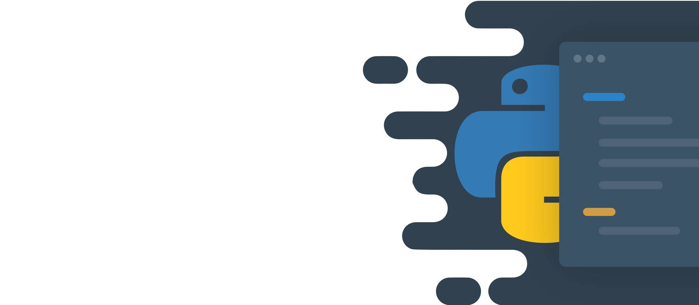

# 🤖 IA - Desempenho de modelos
   

## 📌 Descrição

Este projeto tem como objetivo analisar o desempenho de diferentes técnicas de machine learning em um determinado conjunto de dados. Serão utilizados algoritmos de aprendizado de máquina para treinar e avaliar os modelos, com o objetivo de identificar qual deles apresenta o melhor desempenho. O projeto também inclui a implementação de visualização dos resultados obtidos.

## 💡 Técnicas

- Árvore de decisão
- SVM
- Regressão Logística
- Random Forest
- Naive Bayes 
- KNN

## 📜 Pré-requisitos

Para executar este projeto, você precisará ter instalado em sua máquina:

- Python 3.12.2

Você pode instalar as bibliotecas necessárias executando o seguinte comando:

- pip install requirements.txt
